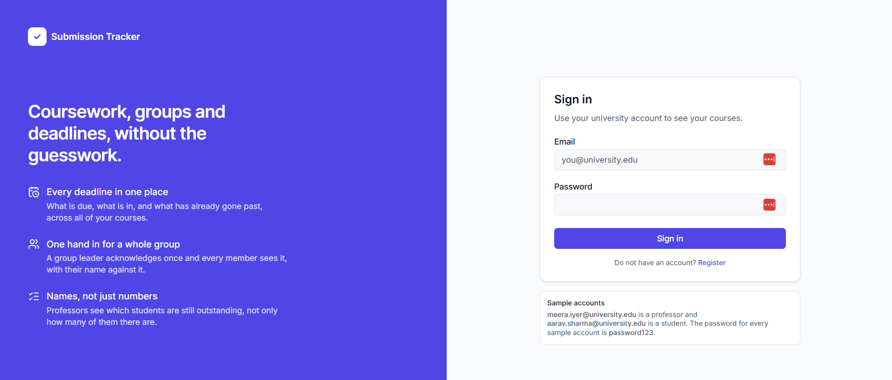
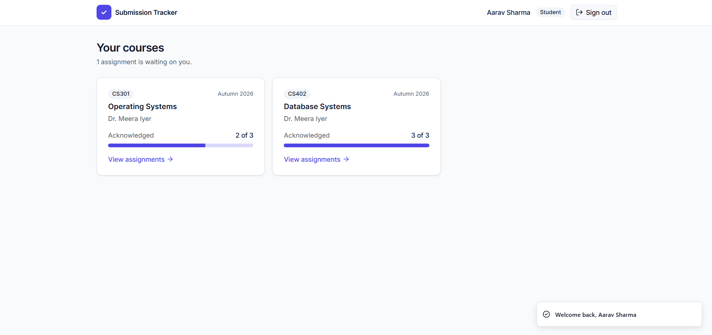
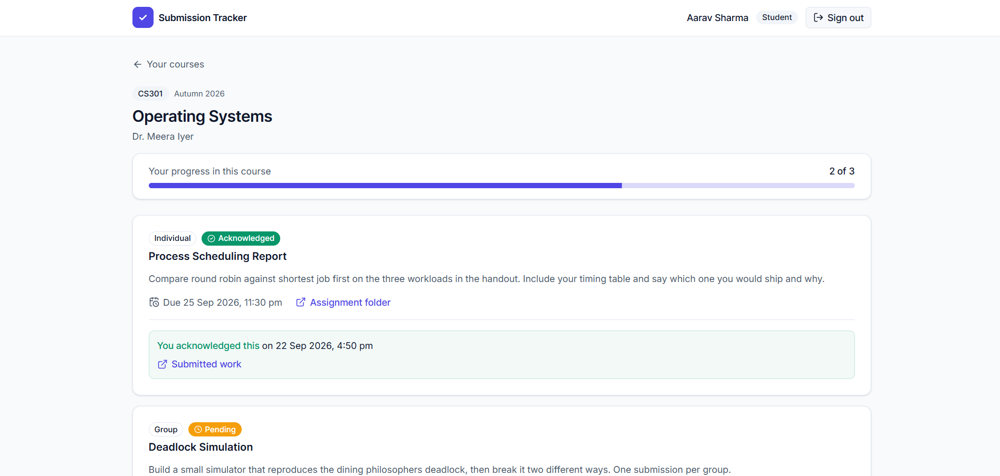
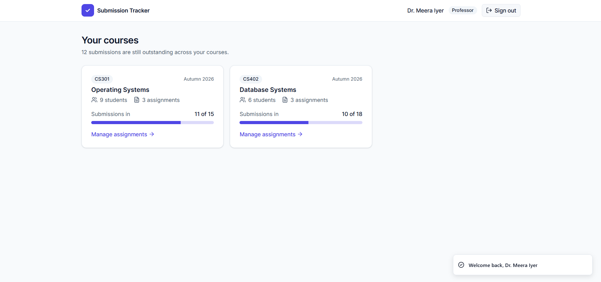
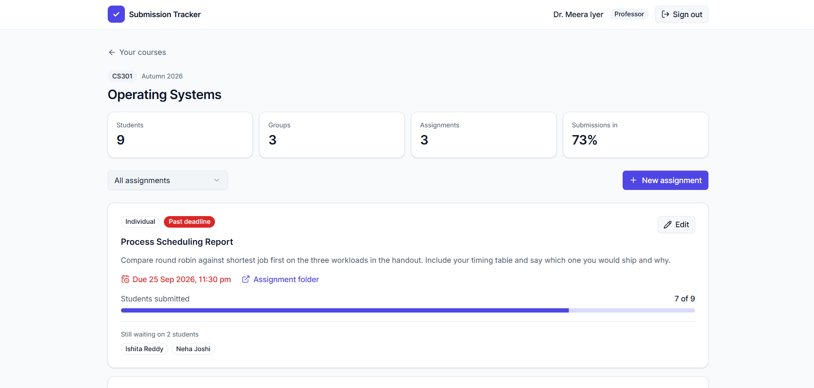
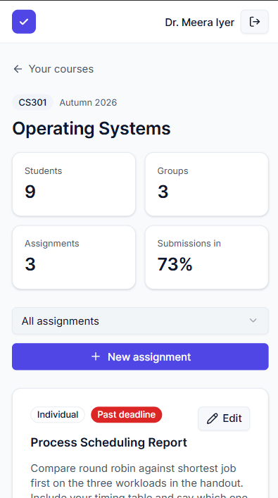

# Submission Tracker

A responsive dashboard where students acknowledge that they have handed in their coursework and professors see who has and who has not, organised by course and by group. Two roles, a simulated sign in flow, and no backend: the data starts from JSON files and lives in localStorage.

Live at [submission-tracker-ruby.vercel.app](https://submission-tracker-ruby.vercel.app).

## Running it

You need Node 20.19 or newer. Everything lives in `frontend/`.

```
cd frontend
npm install
npm run dev
```

That prints a local URL, usually `http://localhost:5173`.

```
npm run build     # production build into dist/
npm run preview   # serve the production build
npm run lint      # oxlint
```

## Signing in

Every sample account uses the password `password123`, and the sign in screen lists two of them so the app can be opened without reading this file.

Professors:

- `meera.iyer@university.edu` teaches CS301 Operating Systems and CS402 Database Systems
- `arjun.rao@university.edu` teaches CS210 Web Development, where nothing has been handed in yet

Students, the three worth starting with:

- `aarav.sharma@university.edu` leads Team Alpha and has one group assignment still to hand in, so the group flow can be tried from the leader's side
- `priya.nair@university.edu` is in Team Alpha but is not the leader, so she sees the same statuses with no controls
- `neha.joshi@university.edu` is enrolled on CS301 but is in no group, which is the case the task asks for a prompt on

The most useful thing to try: sign in as Aarav, acknowledge **Deadlock Simulation**, then sign in as Priya and look at the same assignment. One write by the leader, and every member of the group reads it.

Registering creates a real account in the store and signs you straight in. It starts with no courses, because enrolment is something a university sets, so sign in with a sample account to see a full dashboard.

## Screenshots

Sign in



Student dashboard and course page





Professor dashboard and course page





On a phone



## Folder structure

```
frontend/src/
  components/
    common/     shared pieces: StatusBadge, ProgressSummary, Field, EmptyState, Logo
    layout/     AppShell for signed in screens, AuthLayout for sign in and register
    professor/  CourseCard, AssignmentCard, AssignmentDialog
    student/    CourseCard, AssignmentCard, AcknowledgeDialog
    ui/         shadcn components, copied in and owned rather than imported
  context/      the two contexts and their providers, four files, see below
  data/         the seven JSON seed files, read once at startup and never written to
  hooks/        useData and useAuth, the only way a component reaches a context
  pages/        one file per screen, six of them
  routes/       RequireAuth, RequireRole, RoleHome, ScrollToTop
  utils/        storage, selectors, format, token, validate
  App.jsx       the whole route table
  main.jsx      mounts the app inside both providers
  index.css     the theme, and the only file in the project containing a colour
```

## Component structure

`App.jsx` holds the entire route table in one block, and it nests so that no page repeats a check. `RequireAuth` wraps everything private, so no screen below it asks whether somebody is signed in. `AppShell` draws the header once for all of them. `RequireRole` wraps each role's section, so no screen asks whose it is either. Every page below can read `currentUser` and get on with its job.

`RoleHome` is the role based redirect and sits outside `AppShell` on purpose, because it renders nothing and would otherwise flash a header on the way past.

The two roles have parallel screens rather than shared ones:

- `StudentDashboard` lists enrolled courses with progress, and says at the top how many assignments are actually waiting on that person
- `StudentCoursePage` lists every assignment in one course with its status and its action
- `ProfessorDashboard` lists the courses they teach with a headline completion figure per course
- `ProfessorCoursePage` lists every assignment with its progress, who is still outstanding, a filter and the create button

`student/AssignmentCard` and `professor/AssignmentCard` are separate files, and deliberately so. They show the same assignment but answer different questions. A student asks whether they have handed this in. A professor asks how many have and which of them have not. Merging them would mean a component full of `if role` branches, which is harder to read than two files that each say one thing.

`AcknowledgeDialog` runs the two step flow and is the only thing in the app that writes an acknowledgment. `AssignmentDialog` is one form used for both creating and editing, since both ask for exactly the same five fields.

`Field` takes an input as children rather than rendering one, so the same layout works with an `Input`, a `Textarea` or a `Select` without knowing anything about them.

## Design decisions

### The palette, and why it is this small

Neutrals are slate. `slate-50` for the page, white for cards, `slate-200` for borders, `slate-900` for headings and `slate-600` for body text. A card lifts off the page with a border rather than a shadow, which is quieter and holds up better on a dense screen.

Exactly one accent, `indigo-600`, and it only ever means "this is an action or the thing you are on". Nothing decorative is indigo, so a blue thing on the page is always something to click.

Three status colours and no more: `emerald-600` acknowledged, `amber-500` pending, `red-600` overdue. Because there are only three, a colour always means the same thing wherever it appears, and somebody can learn the whole scheme in one glance at one screen.

Every one of these lives in `src/index.css` in two layers. `:root` holds the raw hex and `@theme inline` turns each into a Tailwind utility, so a component only ever says `bg-primary` or `text-muted-foreground`. No file outside `index.css` contains a colour, which means the whole palette changes in one place.

Type is Inter, one radius, `rounded-lg`, everywhere.

### Why status colour is never the only signal

Every status badge carries an icon as well as a colour. Roughly one man in twelve cannot reliably tell the green from the red, and a badge that says its meaning only in colour says nothing at all to them. The icons cost one line each.

### Why shadcn/ui

It is Tailwind based, so it agrees with the rest of the stack instead of fighting it, and it gave the cards, dialogs, badges, progress bars and toasts a finished look immediately.

The part worth understanding is that it is not a dependency being imported from. The components are source copied into `src/components/ui`, so every one of them can be opened and read, and they were edited where needed. `sonner.jsx` arrived importing `next-themes` to follow a dark mode this app does not have, so that import was removed and the package uninstalled rather than carried.

It is configured on the slate base with `--primary` pointed at indigo-600, so its own tokens and the fixed palette above are the same set of values rather than two schemes sitting on top of each other.

### How the data is shaped

Seven flat collections, joined by join tables, shaped the way a relational database would shape them. Nothing is nested.

```
users           { id, name, email, role, initials, password }
courses         { id, code, title, term, professorId }
enrollments     { id, courseId, studentId }
groups          { id, name, courseId, leaderId }
groupMembers    { id, groupId, studentId }
assignments     { id, courseId, title, description, oneDriveLink, deadline,
                  submissionType, createdBy, createdAt, updatedAt }
acknowledgments { id, assignmentId, subjectType, subjectId,
                  acknowledgedBy, acknowledgedAt, submissionLink }
```

Leadership sits on the group as `leaderId` rather than as a role column on the membership row. One leader per group is then true by construction, where a role column would allow two leaders to exist by accident.

### How a group acknowledgment reaches every member

This is the piece worth reading the code for, and the answer is one sentence: an acknowledgment belongs to whoever is accountable for the work.

For individual work that is the student, so the row is `subjectType: "student"` with `subjectId` set to them. For group work that is the group, so the row is `subjectType: "group"` with `subjectId` set to the group and `acknowledgedBy` recording which leader pressed it.

Members are never written to. A member's status is derived: find their group within that assignment's course, then look for that group's row. One write, and every member reads the same row. There is nothing to keep in sync, nothing goes stale if the membership changes later, and a member sees "Aarav Sharma acknowledged this on 30 Sep" because the leader's name is on the row they are already reading.

The alternative considered was to fan out a row per member when the leader acknowledges. That copies one fact into as many rows as there are members, and turns a derivation into a synchronisation problem the moment anybody joins or leaves. The other option was two separate tables, one for student acknowledgments and one for group ones, which is flatter but repeats the same shape and the same logic twice.

Who is allowed to press the button is one check in one place, `group.leaderId === studentId`, and it is returned as `canAcknowledge` from `getAssignmentStatusForStudent`. The button asks that function whether to render, and `DataProvider.acknowledge` asks the same function before writing, so the interface and the store cannot disagree about permission. A member sees the status and gets no control.

That gate is substantive rather than a greyed out button. Because the leader also supplies the link to the work on the group's behalf, a member does not simply lack permission to tick a box, they have nothing to submit on the group's behalf.

### A position that changed from the previous round, on purpose

The previous round pre created a submission row for every assignment and student pair the moment an assignment existed, because there was no enrollment table and a professor needed a denominator for the progress bar.

This round has `enrollments` and `groups`, so the denominator is derivable: enrolled students for individual work, groups in the course for group work. Pre creating rows is therefore unnecessary, and a row now exists only once somebody has actually acknowledged something. The earlier decision was right for the data available then, and the new tables make the simpler model correct now.

### Why the acknowledgment has two steps

Step one asks for a link to the work and will not move on without something that parses as an http or https address. Step two puts that link back in front of the student, with the deadline and, for group work, the name of the group and how many people it covers, and only then writes.

The two steps are not the same question asked twice. An acknowledgment is a claim about work that lives somewhere this app cannot see, so step one is where that claim gets something behind it, a link a professor can open. Step two is where somebody looks at what they are about to put on the record, for something that cannot be undone. Collapsing them into one click would put an irreversible claim one accidental tap away and leave the professor with a status they cannot check.

### How role isolation is enforced

Every read goes through a named function in `src/utils/selectors.js`, and no screen touches the raw arrays.

The pattern used throughout is to ask the narrower question rather than to ask a broad one and then check the answer. `StudentCoursePage` looks up the course inside `getCoursesForStudent` rather than finding it in the courses table and then testing whether they are enrolled. A course they are not enrolled in is therefore never found in the first place, and there is no separate permission check that could be forgotten on a page written later. `ProfessorCoursePage` does the same thing through `getCoursesForProfessor`.

A course that does not exist and a course that belongs to somebody else get the same message, deliberately, because two different messages would confirm which one it was.

Worth being direct about: this is a boundary in the user interface, not a security boundary. Every row is in the browser and can be read from the console. A real system checks the signed in user on the server for each request, and `selectors.js` is exactly where those calls would go, which is the point of keeping the reads in one small file instead of spreading filters through the components.

### The simulated JWT, and what it is not

The task asks for a JWT flow and also permits a mock API, so the token is built with the shape of a real one and nothing behind it. `makeToken` produces `base64url(header).base64url(payload).signature` with the payload `{ sub, role, name, iat, exp }`, `alg: none` in the header, and a fixed string where a signature belongs. `readToken` decodes it, checks `exp`, and returns null for anything malformed: not a string, the wrong number of parts, invalid base64, invalid JSON, a missing expiry or a past one. The expiry is real and is eight hours.

Being plain about the limits, because they matter:

- Nothing is signed and nothing is verified. Anyone can edit the payload in devtools, set `role` to `professor`, and this app will believe them. That was tested to be sure it is true rather than assumed.
- The payload is readable by anyone. Base64 is encoding, not encryption.
- Passwords sit in plaintext in the seed files and are compared as plaintext.

In a real system the signature is verified on the server on every request, and the client treats the token as opaque. The only honest reason this passes for authentication here is that there is no server to lie to.

One implementation detail worth knowing: encoding goes through `TextEncoder` before `btoa`, because plain `btoa` throws on any character outside Latin 1, which a registered name can easily contain.

`AuthProvider` holds only a token string. It does not know what a user is and has no opinion about passwords. `useAuth` is where the auth context and the data store meet, which is why `login` and `register` live there. The day a real server issues the token, only `useAuth` changes. The payload is decoded on every render rather than stored beside the token, because two copies of the same fact can disagree and an expiring token is exactly the kind of fact that goes stale sitting in state.

### How state persists

`src/data` holds the seed files. They are read once, copied into React state, and never written to, so there is always something clean to fall back to.

From then on the store writes itself to localStorage under `submission-tracker:v2:data`, and the token lives separately under `submission-tracker:token`.

The version is in the key rather than in a field inside the saved object. Old data is simply never read, the app starts from seed, and there is no migration code to write or to get wrong. That closes a limitation named in the previous round's README, which was that unversioned storage would hand anybody who had used an older build data in a shape the new build could not read.

Every call into localStorage is wrapped in try and catch, because it throws rather than returning null when a browser blocks site data, which happens in private windows, and because stored text can be stale or edited by hand so parsing it can throw too. In all of those cases the app falls back to the seed rather than failing to start.

### Dates

Deadlines carry a time, so they are stored as full ISO timestamps and displayed in the reader's own timezone.

The form field needs the opposite conversion, and `toLocalInput` reads the parts off the local `Date` rather than slicing them out of `toISOString`. `toISOString` answers in UTC, so slicing it would hand a professor in India a time five and a half hours away from the one they had just typed.

A new assignment cannot be dated in the past, because nobody could hand it in. An existing one can be, because editing the wording of something whose deadline has already gone by is completely ordinary.

### Why the submission type locks after the first acknowledgment

An acknowledgment row points at a student for individual work and at a group for group work. Changing an assignment from one type to the other would leave every answer already given pointing at the wrong kind of thing. So the select is disabled once anybody has acknowledged, and says why. Everything else about the assignment stays editable, because a clearer description or a later deadline breaks nothing.

### Why `src/context` has four files

A file that exports a provider component and its context object together breaks fast refresh, because the bundler can no longer tell what to hot reload and falls back to reloading the whole page. So `dataContext.js` holds only the `createContext` call and `DataProvider.jsx` holds only the component. The same reason puts the hooks in `src/hooks` rather than beside the providers.

### Responsive approach

Mobile first. The base classes describe the phone layout and `sm:` and `lg:` add to it as the screen grows, so a card grid is `grid-cols-1 sm:grid-cols-2 lg:grid-cols-3` and never the other way round.

Three specific decisions worth naming. The header drops its labels rather than its controls as the screen narrows, so nothing becomes unreachable on a phone. Course cards are entirely clickable rather than carrying a button, which makes the target the size of the card on a small screen and keeps one tab stop per card for a keyboard. And the panel on the sign in screen is hidden below `lg` rather than stacked above the form, because on a phone it would push the password field below the fold.

### Why the sign in screen is the only decorative one

Everywhere else the job is information hierarchy, so ornament competes with the thing somebody came to read. The sign in screen has no information on it, which is exactly why it can carry a first impression instead.

### Why there is no `tailwind.config.js`

Tailwind v4 does not use one. The plugin is wired into `vite.config.js` and the theme lives in `index.css`.

## Two things in the task that needed a decision

The task refers to building on "your previous backend and logic work", where the previous round explicitly ruled out a backend. It also asks for a JWT authentication flow while permitting a mock API. Mocking everything satisfies both readings at once, which is what this does, and the limits of that are spelled out above rather than glossed over.

## Known limitations

The isolation is client side only. It is a boundary in the interface, not a security one, and everything is in the browser.

The token is not signed and not verified, its payload can be read and edited by anyone, and the seed passwords are plaintext. This is covered in full above.

Groups cannot be formed or joined from the interface. They come from the seed data. A student in no group is shown the prompt the task asks for and nothing more, because a button that could not work would be worse than a sentence that is true.

Leadership cannot be transferred, so a group whose leader disappears has no way to hand in.

An assignment can be created and edited but not deleted, and an acknowledgment cannot be withdrawn by either side.

The OneDrive links in the seed data are made up, so opening one lands on an error page. Links entered through the app work normally.

A submission link is only checked for being a well formed http or https address. Nothing confirms it resolves, that it points at real work, or that the professor can open it.

Everything lives in one browser. Two people on two machines do not see each other's data, and clearing site data resets the app.

There are no tests. The selectors are pure functions and were checked with throwaway node scripts while building, which is what the figures in this README come from, but nothing committed would catch a regression.

## What I would do with more time

Put a real backend behind it and move the selectors to authenticated API calls, which is the only way any of the isolation becomes real, and verify the token signature there.

Let students form and join groups, and let a leader hand leadership on, which is the largest gap between this and something a university could actually run.

Let a professor reopen an acknowledgment, since anybody who confirms by mistake currently has no way out.

Add tests around `selectors.js` first, because it holds every access rule and it is pure, so it is both the most important file and the easiest one to cover.

Handle a file upload directly rather than pointing at a OneDrive folder, which would remove the need for the two step flow entirely, because the app could then see the work itself.
